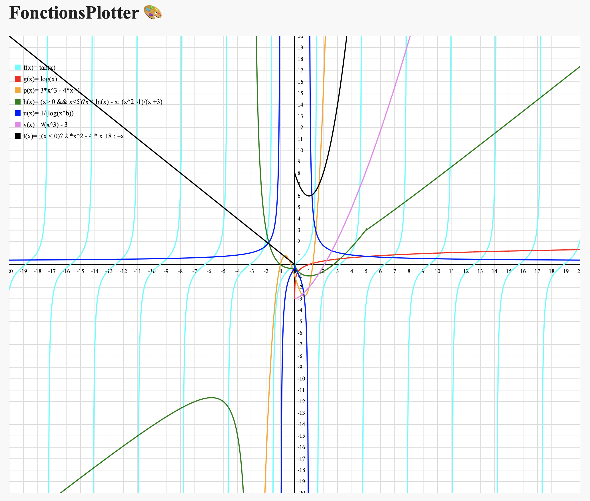
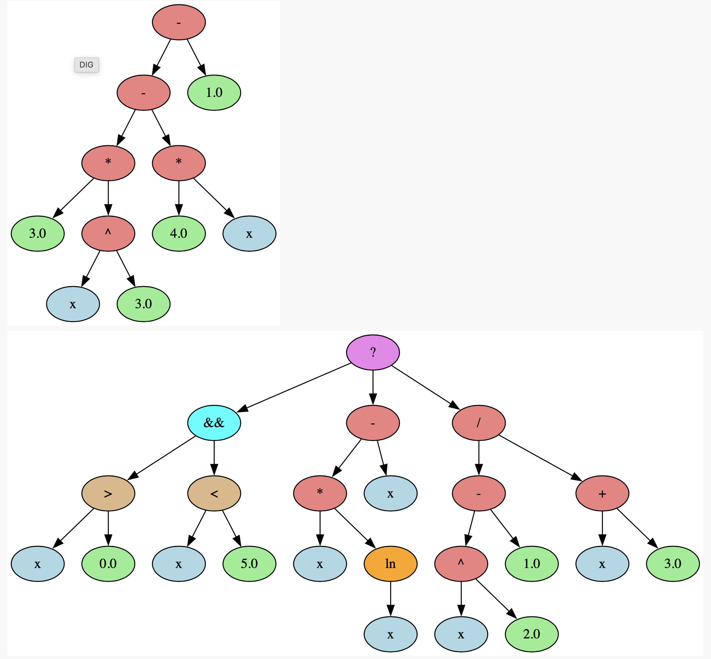

# 📈 FonctionsPlotterSVG  
**Mathematical Expression Parser, Evaluator & SVG Plotter (Java)**

## 🧠 Overview
**FonctionsPlotterSVG** is a Java-based project that parses, evaluates, converts, and visualizes complex mathematical expressions.  
It supports **Infix and Reverse Polish Notation (RPN)**, builds an **Abstract Syntax Tree (AST)**, evaluates expressions with variables, and generates:

- 📊 SVG plots of mathematical functions  
- 🌳 AST visualizations using Graphviz DOT  

The project is designed with a **compiler-like architecture**, focusing on parsing, abstraction, and mathematical modeling.

---

## ✨ Features
- Arithmetic, logical, comparison, unary, binary, and ternary operators
- Trigonometric, logarithmic, exponential, and power functions
- Variable support via parameter mapping
- Infix ↔ RPN conversion
- AST generation and visualization
- SVG function plotting with:
  - axes & grid
  - legend
  - multiple functions
  - custom scaling

---

## 🛠 Technologies & Concepts
**Languages & Tools**
- Java 17+
- JavaScript (expression export)
- SVG
- Graphviz (DOT)

**Computer Science Concepts**
- Tokenization (Lexer)
- Parsing (Infix & RPN)
- Abstract Syntax Tree (AST)
- Sealed Interfaces & Enums
- Expression evaluation
- Tree traversal
- Compiler-style design

---

## 📦 Project Structure
```
.
├── Bool.java
├── Vergleich.java
├── Op.java
├── Expr1.java
├── Token.java
├── ParserInfix.java
├── ParserRPN.java
├── Konvertisseur.java
├── ProductionDot.java
├── SVGPlotterStatic.java
├── FunktionSVG.java
└── meinedemo.java
```

---

## ✅ Requirements
- **Java 17 or higher**
- **lvp-0.5.4.jar**
- All Java source files listed above

---

## 🚀 How to Run
Start the **LVP server** in the project directory:

```bash
java -jar lvp-0.5.4.jar --log --watch=meinedemo.java
```

Open the generated link in your browser.

---

## 🌐 Browser Interface
In the browser you can:

- Configure plot scaling (default values provided)
- Define free parameters and their values  
  **Example:**
  ```
  Parameter name: a
  Parameter value: 2
  ```

- Enter up to **7 mathematical functions**, e.g.:

```text
f(x) = sin(x)
g(x) = x*x
p(x) = ln(x + a)
h(x) = ¡(x > ~3 && x < 4) ? log(√(x+2)) : exp(x^2)
```

Click **Send** after each modification.

---

## 📊 Output
- **SVG plot** with:
  - colored function curves
  - legend
  - title
  - axes & grid
- **AST visualization** generated as DOT files

---

## ⚠️ Syntax Notes
- `!` → factorial  
- `¡` → logical NOT  
- `~` → numeric negation  

⚠️ Expressions like `2x` or `xln(x)` are **not supported**.  
Use explicit operators:
```text
2*x
x*ln(x)
```

---

## 🔁 Infix vs RPN Parsing
By default, the project uses **Infix notation**.

To switch to **RPN parsing**, modify `meinedemo.java`:

```java
//ParserInfix p = new ParserInfix(token);
//expr = p.parse();

ParserRPN prpn = new ParserRPN(token);
expr = prpn.parse(token);
```

⚠️ All functions must use **one notation consistently**.

---

## 🧪 Example Code Snippet
```java
String[] COLORS = { "cyan", "red", "orange", "green", "blue", "violet", "black" };
String[] NOMS = { "f", "g", "p", "h", "u", "v", "t" };

String fi = "~(exp(x))";
String gi = "sin(x)";
String pi = "cos(x)";
String hi = "(x>0 && x<5)? x*ln(x)-x : (x^2-1)/(x+3)";
String ui = "1/(log(x^b))";
String vi = "√(x^3)-3";
String ti = "¡(x < 0)? 2*x^2 - 4*x + 8 : ~x";

String[] expressions = { fi, gi, pi, hi, ui, vi, ti };
```

---

## 🎓 What This Project Demonstrates
- Strong mathematical and analytical skills
- Parsing & compiler fundamentals
- Clean software architecture
- Scientific visualization
- Ability to design complex systems from scratch

---

## 📌 Author
### ZIDANE SOREIL KUISSU YOUMBI
Bioinformatics student (3rd semester)  
Interested in **data analysis, scientific computing, and mathematical modeling**

## 📸 Screenshots




